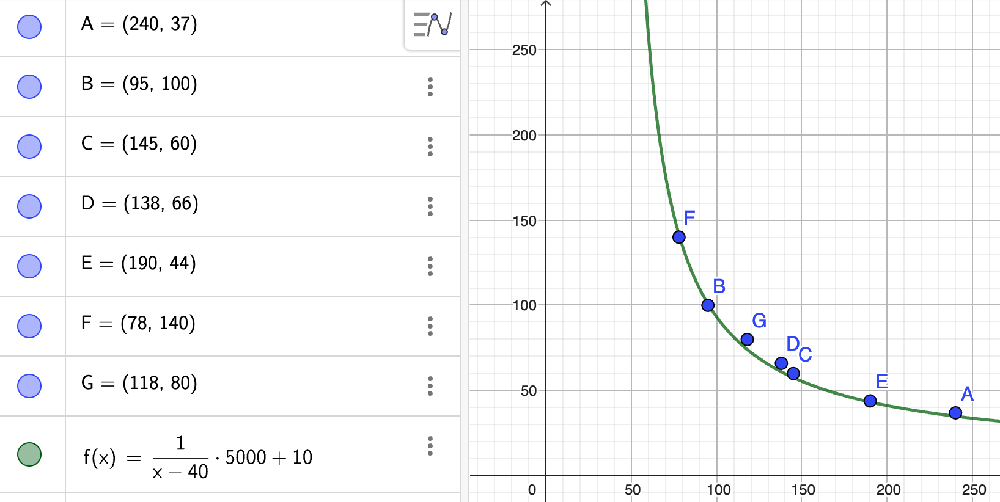
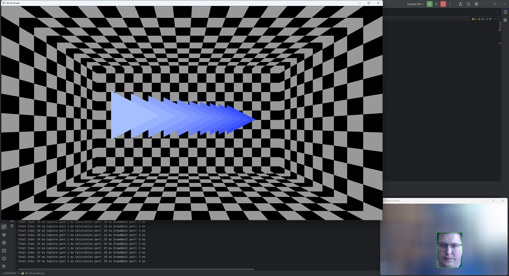
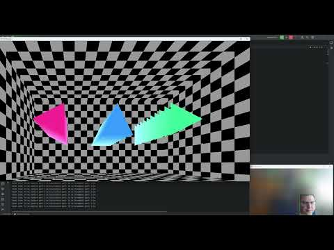
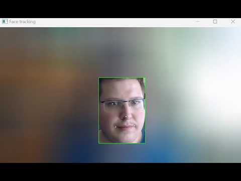
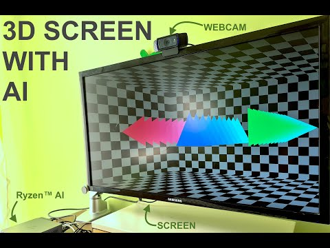

# Interactive, AI-powered 3D screen

<p align="center"></p>

Our monitors and laptop screens are 2D surfaces. They could provide an illusion of a 3D view, but this is seldom utilized. On iPhones, [the parallax effect provided a 3D illusion](https://www.youtube.com/watch?v=gurpi1JBpKM), though it was removed in iOS 16. I remember seeing some 3D illusions a long time ago, but none of these ideas got any traction and we got used to the fact that our displays are merely flat surfaces. I saw a [recent attempt by Asus](https://www.asus.com/content/asus-spatial-vision-technology/) to make the laptop's screen 3D by using lenticular lenses and eye tracking. Lenticular lenses and other [stereoscopic approaches](https://en.wikipedia.org/wiki/Stereoscopy) create the illusion of depth by showing different images to the left and right eyes. The downside of this approach is that it uses specialized components like lenses which are not present in current displays. 

In wanted to create a 3D display that did not require any specialized hardware, utilizing only the advances in ML and AI and computation performance improvements achieved in the recent years. By using a webcam and advanced head tracking, it could be possible to accurately determine the head's position relative the the display. Then the display's image could be changed to reflect as if it was viewed from that position. This approach relies on the head's movement (drawing 3D objects from different perspectives) to achieve the illusion of depth.

It turns out I'm not the only one who though of this. In fact, I found multiple project utilizing the approach of estimating the eye's position relative to the screen and then changing the content based on that:

 - For a kiosk display: [https://medium.com/try-creative-tech/off-axis-projection-in-unity-1572d826541e](https://medium.com/try-creative-tech/off-axis-projection-in-unity-1572d826541e)
 - For iPhone: [https://www.anxious-bored.com/blog/2018/2/25/theparallaxview-illusion-of-depth-by-3d-head-tracking-on-iphone-x](https://www.anxious-bored.com/blog/2018/2/25/theparallaxview-illusion-of-depth-by-3d-head-tracking-on-iphone-x)
 - For iPad: [https://www.youtube.com/watch?v=bBQQEcfkHoE](https://www.youtube.com/watch?v=bBQQEcfkHoE)
 - For Android: [https://github.com/kocosman/DepthIllusionWithARCore](https://github.com/kocosman/DepthIllusionWithARCore)
 - For Wii: [http://johnnylee.net/projects/wii/](http://johnnylee.net/projects/wii/)

Some of these examples are not very recent. The approach used to change a 3D view's perspective to create the illusion of 3D is called off-axis projection. 

Let's see next how the interactive 3D screen would work.

## How to create a 3D screen

The solution consists of two major parts: detecting the orientation of the face relative to the screen and changing the 3D projection based on the orientation. In more granular steps, the method would need the following steps:

<p align="center"></p>

An image is recorded using the webcam. Then the face of the person is detected, followed by the localization of the face landmarks, which includes the center of the eyes. This step is achieved using a neural network, here is where I will utilize AMD's Ryzen AI technology. Then the eyes are transformed to 3D coordinates relative to the display. Finally, there is a need for signal smoothing before modifying the projection to match the viewer's orientation. 

To preserve the illusion, all steps of the process need to be executed within milliseconds. Ideally all of the steps should be executed in less than 33ms to render at least 30 frames per second.

The image above represents different steps needed to achieve the final solution. When coding the solution, I have designed the steps to be modular so that my approach is reusable for different projects as well. In this guide, I will show a simple demonstration of 3D perspective rendering using OpenGL, but the same approach can be uses with other graphics frameworks too. 

Let's get started with the coding.

## Setting up Ryzen AI acceleration

If you have a desktop or laptop with a recent AMD Ryzen CPU, you can utilize the power of Ryzen AI acceleration to speed up the face detection and face landmark generation. AMD has documented this process well both in [this Hackster guide](https://www.hackster.io/512342/amd-pervasive-ai-developer-contest-pc-ai-study-guide-6b49d8) and [on their website](https://ryzenai.docs.amd.com/en/latest/inst.html). Following the guides, I only encountered one issue with the conda environment installing NumPy 2.0.0 which is [incompatible with some of the other packages](https://stackoverflow.com/questions/78636947/a-module-that-was-compiled-using-numpy-1-x-cannot-be-run-in-numpy-2-0-0-as-it-ma). This was resolved by installing NumPy version 1.26.4 using the following command:

```
pip install numpy==1.26.4
```

After that, I could run the demo project without issues and I could see the **Tests passed** and **exit code 0** I was looking for:

<p align="center"></p>

Later, I will show how to run the face detection and landmark generation model which is optimized for the Vitis AI execution provider.

## Development environment

To create the program which runs all the necessary stages of the project, I used Python and the [PyCharm IDE](https://www.jetbrains.com/pycharm/). 

## Image capture

For accurate estimations, I recommend using a high-quality webcam. For this project, I used the Logitech C920 which has Full HD resolution (1920x1080 pixels), though the model I ended up using has an input resolution of `640x608`, so any HD webcam will also work. One assumption I made throughout the project is that the webcam is placed on top of the display, similarly as to how it is in the case of laptops.

### Starting to code

To get started with the image capture part, first, there are a lot of external libraries we need to import. Most of them are already installed in the conda environment but there are two which need to be installed manually using pip, The QT Framework's python module, OpenCV and OpenGL's python wrapper:
```
pip install PySide6
pip install opencv-python
pip install PyOpenGL
```

After everything's installed, we can get started with the imports:

``` python
import PySide6.QtCore
import numpy as np
import cv2
import time
import onnxruntime
import torch
from math import ceil
from itertools import product as product

import sys
from PySide6.QtWidgets import QApplication, QMainWindow
from PySide6.QtOpenGLWidgets import QOpenGLWidget
from OpenGL.GL import *
from OpenGL.GLU import *
```

Then, we need to define a couple of important global variables:

``` python
# WEBCAM native resolution
CAM_WIDTH = 1920
CAM_HEIGHT = 1080

# Pupil distance in m:
PUPIL_DISTANCE_M = 0.62

# Monitor dimensions in m
MONITOR_SCREEN_WIDTH = 0.623
MONITOR_SCREEN_HEIGHT = 0.343

# Webcam preview downscale factor
WEBCAM_PREVIEW_DOWNSCALING = 2
```

The webcam's resolution will be used to image capture and scaling. The distance between the pupils will be used as a reference to estimate the distance of the face from the screen. The monitor's dimensions are also needed for calculating the projection. I have a 28 inch 4K monitor. I found that OpenCV can be slow to render the Webcam preview window, so I added the option to downscale the image to speed up the execution. 

Now let's see the code that handles the webcam image capturing. To keep everything modular, I organized each step of the pipeline into its own class. For handling the webcam, it's the VideoSource class:

``` python
class VideoSource:
    def __init__(self):
        self.cap = cv2.VideoCapture(0, cv2.CAP_DSHOW)
        self.cap.set(3, CAM_WIDTH)  # set Width
        self.cap.set(4, CAM_HEIGHT)  # set Height
        self.cap.set(cv2.CAP_PROP_FOURCC, cv2.VideoWriter_fourcc(*"MJPG"))  # Video compression

    def get_frame(self):
        ret, frame = self.cap.read()
        return frame

    def release(self):
        self.cap.release()
```

The code is really simple, it sets up the video capture instance for the connected webcam. The `0` in the VideoCapture's constructor parameter notes the index of the device. If multiple video devices are connected to your computer, you may need to change that. After creating the video capture instance, the resolution of the expected images are set and video compression is enabled. This reduces the bandwidth needed to send the data from the webcam to the computer, speeding up the process.

There are two additional functions, one for capturing an image from the webcam (`get_frame()`) and one for cleaning up the video capture instance that we will call before our program stops.

## Face detection and landmark generation

In a traditional face recognition pipeline, the detection and recognition steps would be achieved by separate stages/models. I have experimented with this approach by using Haar cascades for face detection and [FaceMesh](https://github.com/PINTO0309/facemesh_onnx_tensorrt) for face landmark (mesh) generation. This method had some limitations though. Haar detection is not a robust face detector, it does not detect heads which are rotated even by a small amount. 

When I tried to optimize this workflow to run on Vitis AI, I found an other model which combined both the face detection and landmark generation steps: RetinaFace. AMD published a Ryzen AI optimized version of this model on [Hugging Face](https://huggingface.co/amd/retinaface) which achieves the [RetinaFace](https://arxiv.org/abs/1905.00641) detection as well as face landmark generation based on the [Pytorch_Retinaface](https://github.com/biubug6/Pytorch_Retinaface) implementation. The advantage of this model is that it is small (it's based on mobilenet0.25), fast and outputs not only the bounding box for the face, but also five landmark points. For our use case, there are only two that are important, the location of the two eyes.

I based this part of my code on [AMD's retinaface code](https://huggingface.co/amd/retinaface/tree/main), though I made several modifications and improvements to reduce the execution time from 50ms to about 30ms. I achieved this by precalculating whatever was possible and optimizing the pre- and postprocessing steps. For example, there is no need to process all the outputs if we are only interested in the most likely one. The final code for this part starts with a helper class to calculate the bounding boxes based on the model's input size and some other parameters:

``` python
class PriorBox(object):
    # SOURCE: https://huggingface.co/amd/retinaface
    def __init__(self, cfg, image_size=None):
        super(PriorBox, self).__init__()
        self.min_sizes = cfg["min_sizes"]
        self.steps = cfg["steps"]
        self.clip = cfg["clip"]
        self.image_size = image_size
        self.feature_maps = [
            [ceil(self.image_size[0] / step), ceil(self.image_size[1] / step)]
            for step in self.steps
        ]

    def forward(self):
        anchors = []
        for k, f in enumerate(self.feature_maps):
            min_sizes = self.min_sizes[k]
            for i, j in product(range(f[0]), range(f[1])):
                for min_size in min_sizes:
                    s_kx = min_size / self.image_size[1]
                    s_ky = min_size / self.image_size[0]
                    dense_cx = [x * self.steps[k] / self.image_size[1] for x in [j + 0.5]]
                    dense_cy = [y * self.steps[k] / self.image_size[0] for y in [i + 0.5]]
                    for cy, cx in product(dense_cy, dense_cx):
                        anchors += [cx, cy, s_kx, s_ky]
        # back to torch land
        output = torch.Tensor(anchors).view(-1, 4)
        if self.clip:
            output.clamp_(max=1, min=0)
        return output
```

Then the main part of the face detection is put in the `FaceDetectorAndLocalizer` class:

``` python
class FaceDetectorAndLocalizer:
    def __init__(self):
        # Model source: https://huggingface.co/amd/retinaface/tree/main
        # Code has been significantly refactored for improved performance
        self.device = torch.device("cpu")
        self.ort = onnxruntime.InferenceSession('RetinaFace_int.onnx',
                                                providers=['VitisAIExecutionProvider'],
                                                provider_options=[{"config_file": 'vaip_config.json'}])
        self.cfg = {
            "name": "mobilenet0.25",
            "min_sizes": [[16, 32], [64, 128], [256, 512]],
            "steps": [8, 16, 32],
            "variance": [0.1, 0.2],
            "clip": False,
        }

        self.input_size = [608, 640]  # Model input size
        self.prior = PriorBox(self.cfg, self.input_size)
        self.priors = self.prior.forward()
        self.priors = self.priors.to(self.device)
        self.prior_data = self.priors.data

        # Rescaling parameters (needed as aspect ratio of captured image model input is different)
        self.scale_tensor = torch.Tensor([self.input_size[1], self.input_size[0], self.input_size[1], self.input_size[0]])
        self.scale_tensor = self.scale_tensor.to(self.device)

        self.scale_tensor_2 = torch.Tensor(
            [self.input_size[1], self.input_size[0],
             self.input_size[1], self.input_size[0],
             self.input_size[1], self.input_size[0],
             self.input_size[1], self.input_size[0],
             self.input_size[1], self.input_size[0],]
        )
        self.scale_tensor_2 = self.scale_tensor_2.to(self.device)

        ratio = self.input_size[0] * 1.0 / self.input_size[1]
        if CAM_HEIGHT * 1.0 / CAM_WIDTH <= ratio:
            self.resize_ratio = self.input_size[1] * 1.0 / CAM_WIDTH
            self.re_h, self.re_w = int(CAM_HEIGHT * self.resize_ratio), self.input_size[1]
        else:
            self.resize_ratio = self.input_size[0] * 1.0 / CAM_HEIGHT
            self.re_h, self.re_w= self.input_size[0], int(CAM_WIDTH * self.resize_ratio)
```

The constructor above sets up the inference session to use the Vitis AI execution provider (Ryzen AI). The `vaip_config.json` referenced is located in the setup package downloaded for Ryzen AI. The model file (`RetinaFace_int.onnx`) can be downloaded from the [Hugging Face repo](https://huggingface.co/amd/retinaface/blob/main/weights/RetinaFace_int.onnx). The benefit of using this model is that it is already optimized for Ryzen AI. When I ran the inference program, I could see that most of the operators could be run on the IPU instead of the CPU:
```
[Vitis AI EP] No. of Operators:    CPU     4    IPU   356   98.89%
[Vitis AI EP] No. of Subgraphs :Actually running on IPU      1
```

There are some matrices precalculated in the constructor (`scale_tensor`, `scale_tensor_2`) which will be used to scale the model's output back to the original frame's dimensions. These operations run on the CPU using PyTorch (`self.device`). 

Next, there are some helper functions in `FaceDetectorAndLocalizer`. `pad_image` pads the downscaled image to the model's input size, while `decode` and `decode_landm` help process the outputs from the model for the bounding box and face landmarks:

``` python
    def pad_image(self, image, h, w, size, pad_value):
        pad_image = image.copy()
        pad_h = max(size[0] - h, 0)
        pad_w = max(size[1] - w, 0)
        if pad_h > 0 or pad_w > 0:
            pad_image = cv2.copyMakeBorder(image, 0, pad_h, 0, pad_w, cv2.BORDER_CONSTANT, value=pad_value)
        return pad_image

    def decode(self, loc, prior, variances):
        box = torch.cat(
            (
                prior[:2] + loc[:2] * variances[0] * prior[2:],
                prior[2:] * torch.exp(loc[2:] * variances[1]),
            ),
            0,
        )
        box[:2] -= box[2:] / 2
        box[2:] += box[:2]
        return box

    def decode_landm(self, pre, prior, variances):
        landms = torch.cat(
            (
                prior[:2] + pre[:2] * variances[0] * prior[2:],
                prior[:2] + pre[2:4] * variances[0] * prior[2:],
                prior[:2] + pre[4:6] * variances[0] * prior[2:],
                prior[:2] + pre[6:8] * variances[0] * prior[2:],
                prior[:2] + pre[8:10] * variances[0] * prior[2:],
            ),
            dim=0,
        )
        return landms
```

The final function in `FaceDetectorAndLocalizer` is the most important one. `detect_and_localize` is where conversion, inference and post processing happens. First, the image (`full_size_frame`) is rescaled and padded to the model's input size (`640x608`) keeping the aspect ratio. Then it is converted to floating point. In the original code, the float conversion happened first, but downscaling first saved about 5ms. Then the downscaled image's dimensions are rearranged to the format, and the inference is executed using Ryzen AI. The output of the model has three parts. The first one contains the bounding boxes, the second contains the confidence scores and the last contains the landmark coordinates. By selecting the bounding box with the highest score early, we can skip processing all the other candidates. The tradeoff here is that our solution will only detect one face. Though the 3D illusion only works for one person anyways since we can only render one perspective on the display. If multiple faces are visible on the webcam image, then the model will pick one to base the perspective of the 3D image on. The logic here could be improved by making sure that the face being detected is the same across the frames so that the perspective would not jump due to the highest prediction fluctuating between the faces. 

``` python
    def detect_and_localize(self, full_size_frame):
        img = cv2.resize(full_size_frame, (self.re_w, self.re_h))
        img = self.pad_image(img, self.re_h, self.re_w, self.input_size, (0.0, 0.0, 0.0))
        img = np.float32(img)

        img -= (104, 117, 123)
        img = img.transpose(2, 0, 1)
        img = torch.from_numpy(img).unsqueeze(0)
        img = img.numpy()
        # preprocess_ms = time.time()

        img = np.transpose(img, (0, 2, 3, 1))

        outputs = self.ort.run(None, {self.ort.get_inputs()[0].name: img})

        loc = torch.from_numpy(outputs[0])
        landms = torch.from_numpy(outputs[2])

        max_ind = np.argmax(outputs[1].squeeze(0)[:, 1])  # Place of maximum of scores, we only care about this
        loc = loc.squeeze(0)[max_ind, :]
        landms = landms.squeeze(0)[max_ind, :]

        box = self.decode(loc, self.prior_data[max_ind, :], self.cfg["variance"])
        box = box * self.scale_tensor / self.resize_ratio
        box = box.cpu().numpy()

        landms = self.decode_landm(landms, self.prior_data[max_ind, :], self.cfg["variance"])
        landms = landms * self.scale_tensor_2 / self.resize_ratio
        landms = landms.cpu().numpy()

        return (np.rint(box)).astype(int), (np.rint(landms)).astype(int)
```

After selecting the predictions belonging to the highest score (`loc = loc.squeeze(0)[max_ind, :]`, `landms = landms.squeeze(0)[max_ind, :]`) the bounding box and landmark outputs are converted back to the original webcam image's coordinates. Then the coordinates are rounded are returned.

## Eye position to relative coordinates

Converting 2D pixel coordinates to 3D real-world coordinates is hard and complicated sine we need to make at least one assumption due to the lack of depth information. Additionally, the camera captures a distorted image, so we have to take that into account. If you are interested in the math, I recommend OpenCV's article on [Camera calibration and 3D Reconstruction](https://docs.opencv.org/2.4/modules/calib3d/doc/camera_calibration_and_3d_reconstruction.html). Essentially, we need to determine the principal point (`cx`, `cy`) and focal lengths (`fx`, `fy`) of the camera. For the Logitech C920 I use, I have found these values in an open source project's, [3dmcap's github repo](https://github.com/thsant/3dmcap/blob/master/resources/Logitech-C920.yaml). For the estimation to be accurate, the depth estimation is also needed. For that, I have recorded the pixel distance of my two eyes for several distinct distances from the camera. I could fit a hyperbola to the recorded data points (eye-to-screen distance (cm) as the function of eye-to-eye pixel distance):

<p align="center"></p>

```
estimated_eye_distance_cm = 5000.0 / (eye_distance - 40) + 10
```

With this function, I could estimate the distance of my head from the webcam and use that to determine the real-world X and Y coordinates in meters of the midpoint of my eyes relative to the display:

``` python
class WebCamTo3DCoordinates:
    def __init__(self):
        # SOURCE: https://github.com/thsant/3dmcap/blob/master/resources/Logitech-C920.yaml
        self.fx = self.fy = 1394.6027293299926
        self.cx = 995.588675691456
        self.cy = 599.3212928484164

    def pixel_to_world(self, x, y, Z):
        X = (x - self.cx) * Z / self.fx
        Y = (y - self.cy) * Z / self.fy
        return X, Y, Z

    def convert(self, eye_coordinates):
        (x_l, y_l, x_r, y_r) = eye_coordinates
        eye_distance = round(np.sqrt((x_r - x_l) ** 2 + (y_r - y_l) ** 2))  # Euclidean distance

        # Formula calculated based on 7 data points in the range of 37cm-140cm:
        estimated_eye_distance_cm = 5000.0 / max(eye_distance - 40, 0.000001) + 10
        estimated_eye_distance_m = estimated_eye_distance_cm / 100

        eye_midpoint_x = round((x_l + x_r) / 2)
        eye_midpoint_y = round((y_l + y_r) / 2)

        real_world_estimated = self.pixel_to_world(eye_midpoint_x, eye_midpoint_y, estimated_eye_distance_m)
        return real_world_estimated

```

## Movement signal filtering

The X-Y-Z eye midpoint 3D coordinate estimation we get from the steps so far inherently includes some noise. In order to reduce this noise, we can utilize signal filtering. I opted to implement a simple [exponential smoothing](https://en.wikipedia.org/wiki/Exponential_smoothing):

``` python
class ExponentialMovingAverage:
    def __init__(self, alpha):
        self.alpha = alpha
        self.sum = 0

    def __call__(self, val):
        self.sum = self.alpha * val + (1 - self.alpha) * self.sum
        return self.sum
```

The smoothing class has a single parameter, alpha, which controls how much influence the new data has on the filter's output. A small alpha would mean that the signal would be slow the respond to changes, an alpha value of 1 would mean no smoothing at all.

## 3D rendering using off-axis projection

So far, we have created the steps to get 3D coordinates for the midpoint of the eyes relative to the display. Now the next step is to use this information to modify the perspective of the image displayed on the screen. Traditionally for 3D visualizations it is assumed that the person sits directly in front of the screen, this is the normal on-axis projection (visualized from the top):

<p align="center"></p>

When the person in front of the screen moves, it's not the same as moving the virtual camera in the 3D environment. Instead, we need to change the view frustum (truncated pyramid) to be skewed. This is called off-axis projection. What the person can see will not be symmetric to the center of the screen:

<p align="center"></p>

As can be seen above, new objects may become visible (red and purple circles) and existing ones will be visible from a different perspective (yellow objects). This is how off-axis projection works. For almost all 3D frameworks, it is possible to configure such a skewed frustum. In OpenGL the view frustum can be configured with the following parameters. The virtual camera is located at the top of the pyramid. The left and right (and top and bottom) values define the slope of the sides and together with the near and far planes define the visible space. Anything between the near and far planes will be visible, anything outside it won't. 

<p align="center"></p>

If you are interested in more complicated projections, I recommend Robert Kooima's [Generalized Perspective Projection paper](http://160592857366.free.fr/joe/ebooks/ShareData/Generalized%20Perspective%20Projection.pdf). The thing to remember about off-axis projection is that the left, right, top, bottom, near and far variables control the projection. In OpenGL, this is achieved by the [`glFrustum` function](https://registry.khronos.org/OpenGL-Refpages/gl2.1/xhtml/glFrustum.xml).

To get started with coding a 3D visualization, we need to create a new class which inherits from `QOpenGLWidget`. This class will house the OpenGL code. In the constructor, we initialize the variables we will use to store the coordinates of the person's eye midpoint (`coord_x`, `coord_y`, `coord_z`). We will multiple scenes we can switch between, so we need to store which scene is currently displayed (`scene_idx`) as well as the total number of scenes (`num_scenes`). Finally, we need a variable we will use for animations (`animation_idx`) and the aspect ratio of the display (`h_w_ratio`):

``` python

class GLWidget(QOpenGLWidget):
    def __init__(self, parent=None):
        super().__init__(parent)
        self.coord_x = 0
        self.coord_y = 0
        self.coord_z = 0

        self.scene_idx = 1
        self.num_scenes = 6
        self.animation_idx = 0
        self.h_w_ratio = MONITOR_SCREEN_HEIGHT / MONITOR_SCREEN_WIDTH
```

Next, we have some inherited functions from the parent class we need to implement. A function is also created for setting up the off-axis projection, though we will use the `glFrustum` directly too:

``` python
    def initializeGL(self):
        glClearColor(0.0, 0.0, 0.0, 1.0)
        glEnable(GL_DEPTH_TEST)

    def resizeGL(self, w, h):
        glViewport(0, 0, w, h)
        self.set_off_axis_projection(-1, 1, -1, 1, 1, 1000)

    def set_off_axis_projection(self, left, right, bottom, top, near, far):
        glMatrixMode(GL_PROJECTION)
        glLoadIdentity()
        glFrustum(left, right, bottom, top, near, far)
        glMatrixMode(GL_MODELVIEW)
```

Our widget will need to receive updated coordinate information from the outside and then update the displayed image. We will also need a way to change the scene that is displayed:

``` python
    def set_frustum(self, x, y, z):
        self.coord_x = x
        self.coord_y = y
        self.coord_z = z
        self.update()

    def change_scene(self):
        self.scene_idx = (self.scene_idx + 1) % self.num_scenes
```

Finally, we need to implement the most important inherited function, `paintGL`. Here, we calculate the frustum offset based on the real-world coordinates of the person and the monitor's size. The left value will be the `x_offset` variable we calculate, the right will be `x_offset-1`. Note that if you were to substitute the edge coordinates of the display (`MONITOR_SCREEN_WIDTH / 2` and `-MONITOR_SCREEN_WIDTH / 2`) you would get (0, -1) and (1,0), right angled triangles along the x-z plane. The calculation of the `y_offset` is similar, the only difference there is that the extent of the frustum is scaled by the aspect ratio. Finally, the z coordinate will determine the near plane, that's how I chose to control frustum's flatness. As the person gets closer to the screen, it will show more depth. The depth range needs to be inverted due to the other parameters of the frustum. Finally, the actual scene drawing part will happen inside the `draw_scene` function.

``` python

    def paintGL(self):
        x_offset = 0.5 + (-self.coord_x / (MONITOR_SCREEN_WIDTH / 2)) / 2
        y_offset = self.h_w_ratio/2 + (-self.coord_y / (MONITOR_SCREEN_HEIGHT / 2)) / 2
        z = max(0.01, self.coord_z)

        glClear(GL_COLOR_BUFFER_BIT | GL_DEPTH_BUFFER_BIT)
        glLoadIdentity()
        gluLookAt(0.0, 0.0, 2.0, 0.0, 0.0, 0.0, 0.0, 1.0, 0.0)

        glFrustum(x_offset, x_offset - 1, y_offset, y_offset - self.h_w_ratio, z, 1000)
        glDepthRange(1.0, 0.0)
        self.draw_scene()
```

To draw multiple shapes which may overlap when displayed, we need to enable blending between them and define how it should be achieved. After that, we can start drawing. Since I am new to OpenGL, I kept the demo to drawing simple shapes, quads and triangles. You can find the full [source code linked to the guide](https://github.com/ndaneil/interactive-3d-screen), so I won't cover every part of the drawing. There are two helper functions I created, one to draw a checkerboard background (`draw_checkerboard_box`) and one to draw octahedrons (`draw_octahedron`). Both are available in the source code. Scene 1 is simple the checkerboard. Scene 2 adds triangles arranged along three axes, each containing ten triangles. For openGL, first `glBegin` needs to be called with the shape type, then shapes can be drawn, finally `glEnd()` needs to be called. For triangles, I needed to set the color and the three vertices for each triangle. 

``` python
    def draw_scene(self):
        glEnable(GL_BLEND)
        glBlendFunc(GL_SRC_ALPHA, GL_ONE_MINUS_SRC_ALPHA)

        if self.scene_idx == 0: 
            # ...
        elif self.scene_idx == 1:  # 3D checkerboard box
            self.draw_checkerboard_box()
        elif self.scene_idx == 2:  # 3D checkerboard box with triangles
            self.draw_checkerboard_box()
            glBegin(GL_TRIANGLES)
            for i in range(10):
                glColor3f(0.2 + (9-i) * 0.05, 0.6 + (9-i) * 0.05, 1.0)
                glVertex3f(0.0, -0.15, -0.9 + i * 0.08)
                glVertex3f(0.15, 0.15, -0.9 + i * 0.08)
                glVertex3f(-0.15, 0.15, -0.9 + i * 0.08)

                glColor3f(1.0, 0.2 + (9-i) * 0.05, 0.6 + (9-i) * 0.05)
                glVertex3f(0.5, 0.15, -0.9 + i * 0.08)
                glVertex3f(0.5, -0.15, -0.9 + i * 0.08)
                glVertex3f(0.8, 0, -0.9 + i * 0.08)

                glColor3f(0.2 + (9-i) * 0.05, 1.0, 0.6 + (9-i) * 0.05)
                glVertex3f(-0.5, 0.15, -0.9 + i * 0.08)
                glVertex3f(-0.5, -0.15, -0.9 + i * 0.08)
                glVertex3f(-0.8, 0, -0.9 + i * 0.08)
            glEnd()
        elif self.scene_idx == 3:  # 3D checkerboard box with triangles #2
            # ...

```

Scene 3 is similar to scene 2. Scene 4 adds rotation for the triangles. Here is where we utilize the `animation_idx` variable to represent the rotation angle of the triangles. To draw the rotated coordinates, I created a [rotation matrix](https://en.wikipedia.org/wiki/Rotation_matrix) (`rotmat`) and multiplied the original vectors with that. Finally, for scene 5, I drew animated rotating octahedrons.

``` python

        elif self.scene_idx == 4:  # 3D checkerboard box with triangles #3
            self.draw_checkerboard_box()
            glBegin(GL_TRIANGLES)
            self.animation_idx = (self.animation_idx+1) % 360
            for i in range(8):
                rotmat = np.array([[np.cos(np.deg2rad(i * 10 + self.animation_idx)), -np.sin(np.deg2rad(i * 10 + self.animation_idx))],
                                   [np.sin(np.deg2rad(i * 10 + self.animation_idx)), np.cos(np.deg2rad(i * 10 + self.animation_idx))]])
                rotated_1 = np.matmul(rotmat, np.array([[0.1], [0.15]]))
                rotated_2 = np.matmul(rotmat, np.array([[0.1], [-0.15]]))
                rotated_3 = np.matmul(rotmat, np.array([[-0.2], [0.0]]))

                glColor3f(1.0, 0.2 + i * 0.05, 0.3 + i * 0.05)
                glVertex3f(rotated_1[0, 0], rotated_1[1, 0], -0.9 + i * 0.11)
                glVertex3f(rotated_2[0, 0], rotated_2[1, 0], -0.9 + i * 0.11)
                glVertex3f(rotated_3[0, 0], rotated_3[1, 0], -0.9 + i * 0.11)
            glEnd()
        elif self.scene_idx == 5:  # 3D checkerboard box with octahedrons
            self.draw_checkerboard_box()
            self.animation_idx = (self.animation_idx + 1) % 360
            rotation = abs(self.animation_idx-180)/4-22.5
            self.draw_octahedron(0.5, 0, -0.7,
                                 0.2, 0.4, 0.2,
                                 0.8, 0.1, 0.2,
                                 0.6, 0.1, 0.2, np.deg2rad(rotation))
            self.draw_octahedron(-0.5, 0, -0.7,
                                 0.2, 0.4, 0.2,
                                 0.2, 0.1, 0.8,
                                 0.2, 0.1, 0.6, np.deg2rad(rotation))
            self.draw_octahedron(0, 0, -0.3,
                                 0.2, 0.4, 0.2,
                                 0.3, 0.8, 0.2,
                                 0.2, 0.6, 0.2, np.deg2rad(-rotation))
```

The drawing part is almost complete, we just need one more class representing the window we want to display. We can set the window title, the starting size and we can create an instance of our OpenGL widget, setting it as the main widget for the window. We also need to expose the scene and view coordinate changing functions. Finally, to control the application, we can override the `keyPressEvent` function. If the escape key is pressed, the application should be closed. Here videoSource is also referenced which will be an instance of the VideoSource class we have defined earlier. The space key press will be used to switch between the scenes and the `f` key can be used to switch between full-screen and windowed mode.

``` python 
class MainWindow(QMainWindow):
    def __init__(self):
        super().__init__()
        self.setWindowTitle("3D AI Screen")
        self.setGeometry(100, 100, 1920, 1080)
        self.gl_widget = GLWidget(self)
        self.setCentralWidget(self.gl_widget)
        self.is_fullscreen = False

    def set_frustum(self, x, y, z):
        self.gl_widget.set_frustum(x, y, z)

    def change_scene(self):
        self.gl_widget.change_scene()

    def keyPressEvent(self, event):
        if event.key() == PySide6.QtCore.Qt.Key.Key_Escape:  # press 'ESC' to quit
            videoSource.release()
            cv2.destroyAllWindows()
            sys.exit()
        elif event.key() == ord(" "):  # press 'SPACE' to change view
            view.change_scene()
        elif event.key() == 70:  # press 'f' to toggle fullscreen mode
            self.is_fullscreen = not self.is_fullscreen
            if self.is_fullscreen:
                self.showFullScreen()
            else:
                self.showNormal()
```

## Connecting everything together

Now it's time to connect all the component classes we created. First, we crate a QT application with a window and show it. We define the filters we will use for the x, y and z coordinates. We also need an instance of the `VideoSource`, `WebCamTo3DCoordinates` and `FaceDetectorAndLocalizer` classes.

``` python
app = QApplication(sys.argv)
view = MainWindow()
view.show()

xSmoother = ExponentialMovingAverage(0.3)
ySmoother = ExponentialMovingAverage(0.3)
zSmoother = ExponentialMovingAverage(0.2)

videoSource = VideoSource()
webCamTo3D = WebCamTo3DCoordinates()

faceDetectorAndLocalizer = FaceDetectorAndLocalizer()
```

Next, we need a while loop. We will measure the execution time too, so there will be calls to `time.time()`. First, we capture a frame from the video source. Then, we detect face and landmarks, returning the bounding box and landmark coordinates. Then we can crop the face and blur the rest of the background. This will be used to visualize the detection on a separate window. After drawing the landmarks on the image canvas we want ot display (`to_show`), the 2D eye coordinates are converted to a 3D position. This is followed by filtering and setting the OpenGL window's projection according to the filtered coordinate values. As a final step, the face tracking image is shown on a separate window (the escape key press is also monitored when this window is is focus) and the detailed loop execution times are printed ot the console.

``` python
while True:
    start_time = time.time()

    frame = videoSource.get_frame()
    to_show = frame.copy()

    frame_capture_time = time.time()

    bbox, landmarks = faceDetectorAndLocalizer.detect_and_localize(frame.copy())

    (x0, y0, x1, y1) = bbox
    to_show = cv2.blur(to_show, (400, 400))
    to_show[y0:y1, x0:x1, :] = frame[y0:y1, x0:x1, :]
    color = (0, 255, 0)
    cv2.rectangle(to_show, (x0, y0), (x1, y1), color, 2)

    for i in range(5):
        cv2.circle(img=to_show, center=(landmarks[2*i], landmarks[2*i+1]), radius=2, color=(255, 255, 255), thickness=2)

    estimated_coordinates = webCamTo3D.convert(landmarks[0:4])
    (X, Y, Z) = estimated_coordinates

    X = xSmoother(X)
    Y = ySmoother(Y)
    Z = zSmoother(Z)

    view.set_frustum(X, Y, Z)

    to_show = cv2.resize(to_show, (round(CAM_WIDTH / 2), round(CAM_HEIGHT / 2)))

    cv2.imshow('Face tracking', to_show)
    midtime = time.time()

    k = cv2.waitKey(1) & 0xff
    if k == 27:  # press 'ESC' to quit
        videoSource.release()
        cv2.destroyAllWindows()
        sys.exit()

    endtime = time.time()
    print("Total time:", round((endtime - start_time) * 1000), "ms",
          "Capture part", round((frame_capture_time - start_time) * 1000), "ms",
          "Calculation part:", round((midtime - frame_capture_time) * 1000), "ms",
          "Draw&Wait part:", round((endtime - midtime) * 1000), "ms")
```


## Running the code

Now we are ready to run the code. You can find the full [source code linked to the guide](https://github.com/ndaneil/interactive-3d-screen). Make sure to select the ryzenai conda environment and run the script. You should see the checkerboard pattern in a large window and the webcam image with face detection on a separate, smaller window. You can use the space key to switch between the scenes and you can use the `f` key to enter fullscreen mode.

<p align="center"></p>

On my UM 790 Pro Mini PC, the loop execution took between 30 and 40ms, so for the 3D visualization I got 25-33 FPS. There are further improvement possibilities on the webcam image capture side, like using a separate thread to make ensure there is always a frame available when running the main loop. 

I have created a couple of demo videos to show the program in action. The first one shows the program running on the PC: 

[](https://youtu.be/KFc5EAXHat0)


The second video demonstrates the robustness of the face tracking model:

[](https://youtu.be/7E3ihFjl_Mw)


The final demo shows how the screen works from the viewer's perspective. Sadly, here my phone's video stabilization interfered with the 3D effect. The results are much better in person than on the video.

[](https://youtu.be/qD47s6MBjw0)


## A note on licenses

All third-party brands (including brand names, logos, trademarks and icons) remain the property of their respective owners. 

[AMD's retinaface model](https://huggingface.co/amd/retinaface) and the accompanying source code they published are licensed under [Apache 2.0](https://huggingface.co/datasets/choosealicense/licenses/blob/main/markdown/apache-2.0.md).